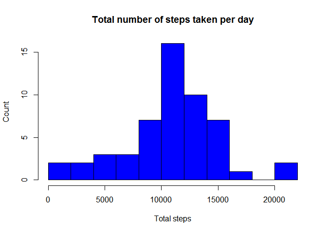
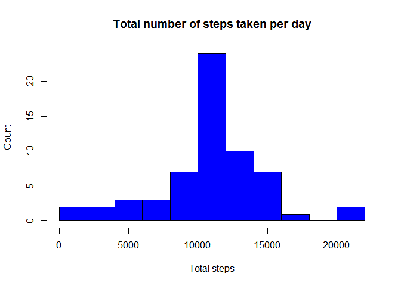
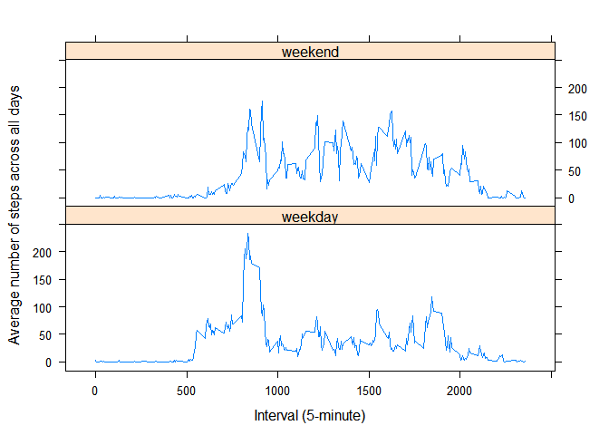

# Reproducible Research: Peer Assessment 1
Carlos Toro  

### Global Options

The Global options are set to show all R code used to make this markdown.


```r
library(knitr)
```

```
## Warning: package 'knitr' was built under R version 3.1.1
```

```r
opts_chunk$set(echo=TRUE)
```

### Loading and preprocessing the data

1. First, the working directory is set, then the data is loaded and assigned to **activityData** variable by using *read.csv()* function.

```r
setwd("/Users/usuario/Desktop/COURSERA/DSC/5. Reproducible Research/Project1")
activityData <- read.csv("activity.csv", colClasses=c("numeric", "Date", "numeric"))
```

2. The variables types are changed to ease the manipulation in R. **steps** and **internal** are converted to R *numeric* type and **date** is converted to R *date* type. A summary of the data is shown below:


```r
summary(activityData)
```

```
##      steps            date               interval   
##  Min.   :  0.0   Min.   :2012-10-01   Min.   :   0  
##  1st Qu.:  0.0   1st Qu.:2012-10-16   1st Qu.: 589  
##  Median :  0.0   Median :2012-10-31   Median :1178  
##  Mean   : 37.4   Mean   :2012-10-31   Mean   :1178  
##  3rd Qu.: 12.0   3rd Qu.:2012-11-15   3rd Qu.:1766  
##  Max.   :806.0   Max.   :2012-11-30   Max.   :2355  
##  NA's   :2304
```

### What is mean total number of steps taken per day?

1. This is the Histogram of the total number of steps taken each day:

```r
totalSteps <- aggregate(steps ~ date, activityData, sum)
hist(totalSteps$steps, main="Total number of steps taken per day", xlab = "Total steps", ylab = "Count", col = "blue", breaks = 11)
```

 

2. The mean and median of the total number of steps taken per day is calculated:

```r
meanSteps <- mean(totalSteps$steps)
meanSteps
```

```
## [1] 10766
```

```r
medianSteps <- median(totalSteps$steps)
medianSteps
```

```
## [1] 10765
```
  a. The mean of total number of steps taken per day is *1.0766 &times; 10<sup>4</sup>* steps.
  b. The median of total number of steps taken per day is *1.0765 &times; 10<sup>4</sup>* steps.

### What is the average daily activity pattern?

1. The time series plot of the 5-minute interval (x-axis) and the average number of steps taken, averaged across all days (y-axis):

```r
avgDailysteps <- aggregate(steps ~ interval, activityData, mean)
plot(avgDailysteps, type="l", xlab="Time Intervals (5-minute)", ylab="Average number of steps taken (all Days)", main = "Average steps taken accross all days", col="blue")
```

 

2. The maximum number of steps is calculates as its contained on the interval on average across all the days in the dataset. 


```r
maxInterval <- avgDailysteps$interval[which.max(avgDailysteps$steps)]
maxInterval
```

```
## [1] 835
```
is *835th* minute.

### Imputing missing values

1. The total number of rows with missing values (NAs) in the dataset 

```r
totalNA <- sum(is.na(activityData))
totalNA
```

```
## [1] 2304
```
is *2304*.

2. The mean value across all days is replaced with all the missing values (NAs) in the dataset.

```r
activityDataNA <- activityData
activityDataNA$steps[is.na(activityDataNA$steps)] <- avgDailysteps$steps
```

3. The new dataset **activityDataNA** is the same as the original dataset **activityData** with the difference that the missing values of the original were filled in with the mean values across all days.


```r
summary(activityData)
```

```
##      steps            date               interval   
##  Min.   :  0.0   Min.   :2012-10-01   Min.   :   0  
##  1st Qu.:  0.0   1st Qu.:2012-10-16   1st Qu.: 589  
##  Median :  0.0   Median :2012-10-31   Median :1178  
##  Mean   : 37.4   Mean   :2012-10-31   Mean   :1178  
##  3rd Qu.: 12.0   3rd Qu.:2012-11-15   3rd Qu.:1766  
##  Max.   :806.0   Max.   :2012-11-30   Max.   :2355  
##  NA's   :2304
```

```r
summary(activityDataNA)
```

```
##      steps            date               interval   
##  Min.   :  0.0   Min.   :2012-10-01   Min.   :   0  
##  1st Qu.:  0.0   1st Qu.:2012-10-16   1st Qu.: 589  
##  Median :  0.0   Median :2012-10-31   Median :1178  
##  Mean   : 37.4   Mean   :2012-10-31   Mean   :1178  
##  3rd Qu.: 27.0   3rd Qu.:2012-11-15   3rd Qu.:1766  
##  Max.   :806.0   Max.   :2012-11-30   Max.   :2355
```

4. This is the histogram of the total number of steps taken each day with the missing values replaced with the average:

```r
totalStepsNA <- aggregate(steps ~ date, activityDataNA, sum)
hist(totalStepsNA$steps, main="Total number of steps taken per day", xlab = "Total steps", ylab = "Count", col = "blue", breaks = 11)
```

 

The mean and median of the total number of steps taken per day with the missing values replaced with the average:

```r
meanStepsNA <- mean(totalStepsNA$steps)
meanStepsNA
```

```
## [1] 10766
```

```r
medianStepsNA <- median(totalStepsNA$steps)
medianStepsNA
```

```
## [1] 10766
```
a. The mean of the total number of steps taken per day is *1.0766 &times; 10<sup>4</sup>* steps.
b. The median of the total number of steps taken per day is *1.0766 &times; 10<sup>4</sup>* steps.

### Are there differences in activity patterns between weekdays and weekends?

1. First we sepaarated the data to see wether its a Weekday or Weekend, as indicated on the date.

```r
weekActivity <- activityData
weekActivity$weekdays <- factor(format(weekActivity$date, "%A"))
levels(weekActivity$weekdays) <- list(weekday=c("lunes", "martes", "miércoles", "jueves", "viernes"), weekend = c("sábado", "domingo"))
```

2. The time series plot of the 5-minute interval (x-axis) and the average number of steps taken, averaged across all weekday days and all the weekend days (y-axis):


```r
avgWeekSteps <- aggregate(steps ~ interval + weekdays, weekActivity, "mean")

library(lattice)
xyplot(steps ~ interval | weekdays, avgWeekSteps, layout=c(1, 2), type="l", xlab="Interval (5-minute)", ylab="Average number of steps across all days")
```

 

